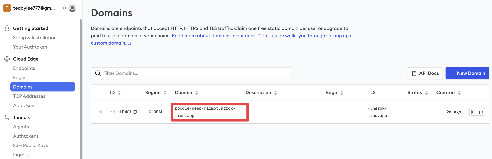

## HuggingFace gguf 파일을 Ollama 로딩

> HuggingFace-Hub 설치
```bash
pip install huggingface-hub
```

아래의 예시는 `EEVE-Korean-Instruct-10.8B-v1.0`
- HF: https://huggingface.co/yanolja/EEVE-Korean-Instruct-10.8B-v1.0
- GGUF: https://huggingface.co/heegyu/EEVE-Korean-Instruct-10.8B-v1.0-GGUF

GGUF 파일을 다운로드 받기 위하여 https://huggingface.co/heegyu/EEVE-Korean-Instruct-10.8B-v1.0-GGUF 에서 원하는 .gguf 모델을 다운로드 받습니다.

순서대로
- `HuggingFace Repo`
- .gguf 파일명
- local-dir 설정
- 심볼릭 링크 설정
  
```bash
huggingface-cli download \
  heegyu/EEVE-Korean-Instruct-10.8B-v1.0-GGUF \
  ggml-model-Q5_K_M.gguf \
  --local-dir 본인의_컴퓨터_다운로드폴더_경로 \
  --local-dir-use-symlinks False
```

### Modelfile

> EEVE-Korean-Instruct-10.8B-v1.0 예시
```
FROM ggml-model-Q5_K_M.gguf

TEMPLATE """{{- if .System }}
<s>{{ .System }}</s>
{{- end }}
<s>Human:
{{ .Prompt }}</s>
<s>Assistant:
"""

SYSTEM """A chat between a curious user and an artificial intelligence assistant. The assistant gives helpful, detailed, and polite answers to the user's questions."""

PARAMETER stop <s>
PARAMETER stop </s>
```

> openbuddy-llama2-13b 예시
```
FROM openbuddy-llama2-13b-v11.1.Q4_K_M.gguf

TEMPLATE """{{- if .System }}
<|im_start|>system {{ .System }}<|im_end|>
{{- end }}
<|im_start|>user
{{ .Prompt }}<|im_end|>
<|im_start|>assistant
"""

SYSTEM """"""

PARAMETER stop <|im_start|>
PARAMETER stop <|im_end|>
```

## Ollama 실행

```bash
ollama create EEVE-Korean-10.8B -f EEVE-Korean-Instruct-10.8B-v1.0-GGUF/Modelfile
```

Ollama 모델 목록

```bash
ollama list
```

Ollama 모델 실행

```bash
ollama run EEVE-Korean-10.8B:latest
```

## LangServe 에서 Ollama 체인 생성

app 폴더 진입 후

```bash
python server.py
```

## ngrok 에서 터널링(포트 포워드)

```bash
ngrok http localhost:8000
```


NGROK 도메인 등록 링크: https://dashboard.ngrok.com/cloud-edge/domains

> 고정 도메인이 있는 경우
```bash
ngrok http --domain=poodle-deep-marmot.ngrok-free.app 8000
```

## GPU 사용량 모니터링

Github Repo: https://github.com/tlkh/asitop

```bash
pip install asitop
```

패스워드 설정
```bash
sudo asitop
```
실행
```bash
asitop
```

## License

소스코드를 활용하실 때는 반드시 출처를 표기해 주시기 바랍니다.

```
MIT License

Copyright (c) 2024, 테디노트

Permission is hereby granted, free of charge, to any person obtaining a copy of this software and associated documentation files (the "Software"), to deal in the Software without restriction, including without limitation the rights to use, copy, modify, merge, publish, distribute, sublicense, and/or sell copies of the Software, and to permit persons to whom the Software is furnished to do so, subject to the following conditions:

The above copyright notice and this permission notice shall be included in all copies or substantial portions of
